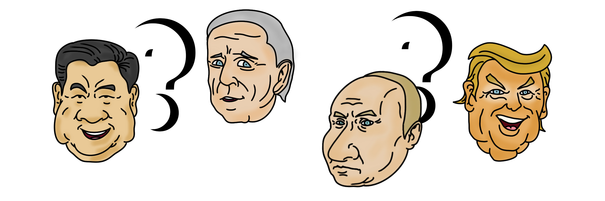

# Assets

There are two types of NFTs:

1 ) P. NFTs (presidents)

* They are only available with Matic
* There are 2 Levels of P. NFTs

2 ) U. NFTs (utility)

* They are only available with UP or in the marketplace (Matic and UP)
* There are also 2 Levels of U. NFTs

3 ) L. NFTs (legendary)

* They are only available with UP or in the marketplace (Matic and UP)

4 ) TSK token is our game ERC20 token

* Taxes included

