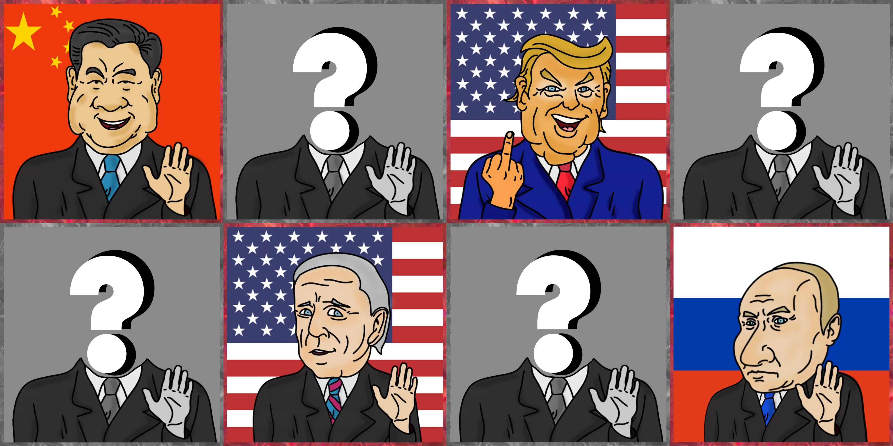

# P. NFT

### Minting

* Mid March first 80 P. NFTs of first 4 presidents (320 players)
* Mid March first 80 P. NFTs of last 6 presidents (480 players)
* On April 7, users will be able to mint 1 P. NFT of each type every 6 hours (for all users)

**Between May and June** all NFTs will be sold and we'll reach teh **maximun of 2000 players**

<table><thead><tr><th>Level</th><th>Each NFT</th><th>President</th><th align="right">RP</th><th data-type="checkbox" data-hidden></th><th data-hidden></th></tr></thead><tbody><tr><td>ONE</td><td> 15$ in Matic</td><td>45$ in Matic</td><td align="right">x 1</td><td>false</td><td></td></tr><tr><td>TWO</td><td> 45$ in Matic </td><td>135$ in Matic</td><td align="right">x 3</td><td>false</td><td></td></tr></tbody></table>

### Atributes

* Cowardice
* Diplomacy
* Ferocity
* Lawbreaker
* Dumb child intensity

